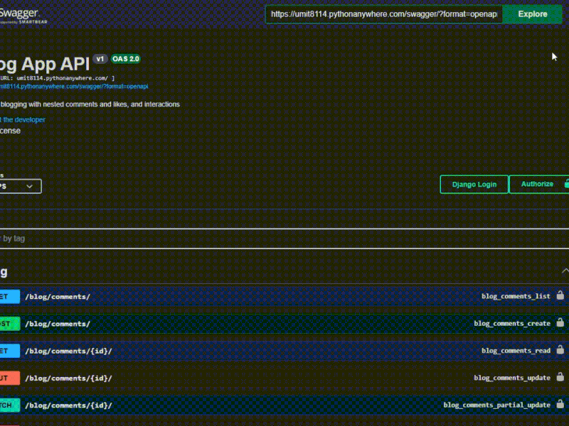

<p align="center">
  
  
  
  
</p>

<h1 align="center">📝 Blog API</h1>

<p align="center"><strong>A robust, production-ready REST API for modern blogging platforms 🚀</strong></p>


<div align="center">
  <h3>
    <a href="https://umit8114.pythonanywhere.com/">
      🖥️ Live Demo (Swagger)
    </a>
     | 
    <a href="https://github.com/umitarat-dev/blog-api">
      📂 Repository
    </a>
  </h3>
</div>

<p align="center">
  <a href="https://umit8114.pythonanywhere.com/">
    
  </a>
</p>

## 📚 Navigation
- [🚀 Live API Documentation](#-live-api-documentation)
- [📦 Key Features](#-key-features)
- [🛠️ Built With](#️-built-with)
- [⚙️ Setup & Installation](#️-setup--installation)
- [🧪 API Testing](#-api-testing)
- [📬 Contact Information](#-contact-information)


## 🚀 Live API Documentation
The API is fully documented and interactive. You can test all endpoints (Auth, Blog, Comments, Likes) directly through:
* **Swagger UI:** [https://umit8114.pythonanywhere.com/](https://umit8114.pythonanywhere.com/)
* **ReDoc:** [https://umit8114.pythonanywhere.com/redoc/](https://umit8114.pythonanywhere.com/redoc/)


## 📦 Key Features
* **Hierarchical Content:** Advanced nested routing for comments and interactions using `drf-nested-routers`.
* **Smart Analytics:** Automatic tracking of post view counts and real-time like/comment tallies.
* **Environment Orchestration:** Modular settings (Base/Dev/PythonAnywhere) for secure and scalable deployment.
* **Production Hardened:** Integrated with **WhiteNoise** for efficient static file serving.


## 🛠️ Built With
* **Core:** [Django 5.0.6](https://www.djangoproject.com/) & [Django REST Framework](https://www.django-rest-framework.org/)
* **Auth:** [dj-rest-auth](https://dj-rest-auth.readthedocs.io/) with JWT/Token Authentication 
* **Database:** SQLite (Production Optimized)
* **Hosting:** [PythonAnywhere](https://www.pythonanywhere.com/)


## ⚙️ Setup & Installation

### Local Development
1. **Clone the repository:**
```bash
git clone [https://github.com/umitarat-dev/blog-api.git](https://github.com/umitarat-dev/blog-api.git)
cd blog-api
```


2. **Environment Setup:**
  - Create a virtual environment: python -m venv env   
  - Activate it: source env/bin/activate (Mac/Linux) or env\Scripts\activate (Win)
  - Install dependencies: pip install -r requirements.txt   

3. **Configuration:**
  - Create a .env file in the root directory:

```js
SECRET_KEY=your_secret_key
ENV_NAME=dev
DEBUG=True
```

4. **Database & Run:**

```Bash
python manage.py migrate
python manage.py runserver
```

## 🧪 API Testing
A dedicated Postman Collection is provided in the postman/ directory for detailed request analysis.


## 📬 Contact Information

I am always open to discussing new projects, creative ideas, or opportunities to be part of your visions.

* **LinkedIn:** [linkedin.com/in/umit-arat](https://www.linkedin.com/in/umit-arat/)
* **Email:** [umitarat8098@gmail.com](mailto:umitarat8098@gmail.com)
* **GitHub:** [github.com/umitarat-dev](https://github.com/umitarat-dev) (Current Workspace)
test